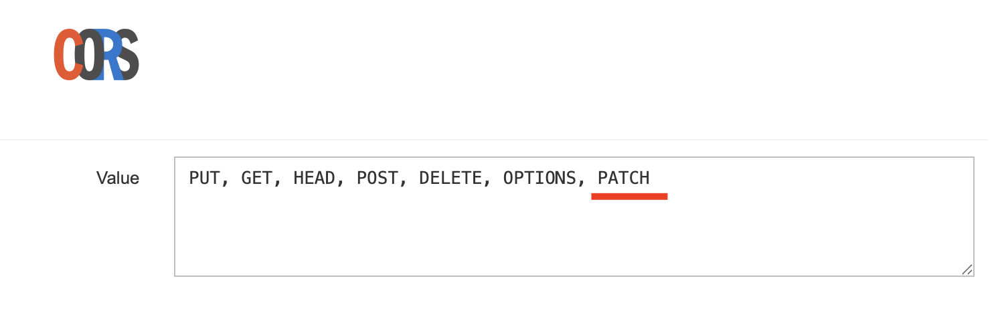

## NestJS & NextJS Categories project with Turborepo

Make sure your browser plugin is configured also for PATCH requests:



This repository provides a scalable and efficient `monorepo` setup using Turborepo. It includes `NestJS` for backend
services and `React Flow` for frontend applications, with a suite of tools and libraries configured for seamless development and deployment.

I removed carefully unnecessary code from the boilerplate (https://github.com/theaungphyo/turborepo.git) and set up the configuration. I also moved files from another repository into this one and created a Dockerfile, making it easy to compose a container. For development purposes, it’s beneficial to separate controlling the container from running the project, but this can be combined if needed.

Also, for the simplicity, quick and effective run of this application .env files are checked in (normally bad practise).

The code was written using Visual Studio Code (Version: 1.103.1) with GitHub Copilot, Chrome browser, on Apple M2 Max machine.

I used nestJS CLI to generate a new module.

### **Features**

- `NestJS (v11)` backend
- `React Flow (v12)` frontend
- `SWC` for fast TypeScript and JavaScript transpilation
- `pnpm` for efficient dependency management
- `PostgreSQL` database with TypeORM
- `Linting` and `Formatting` pre-configured for code quality
- `Micro-Frontend` Support with Turborepo

### **Table of Contents**

- Installation
- Getting Started
- Project Structure
- Scripts
- License

### **Installation**

# Required software

Tested on Mac OS (26.0) Tahoe Beta 7

- Docker (desktop) 4.44.3 (202357)
- NVM - Node v22.15.0
- pnpm 10.0.0
- DBeaver Version 25.1.5.202508171444

Clone the repository:

```shell
git clone https://github.com/victorioussolutionsltd/turbo_categories
```

Navigate to the project directory:

```shell
cd turbo-categories
```

Install dependencies using pnpm:

```shell
pnpm install
```

Getting Started
To start the development server, run:

```shell
pnpm docker:up
pnpm dev
```

This will start both the NestJS backend and the Next.js frontend in development mode.

Project Structure
The repository is organized into the following structure:

```yaml
turborepo
├── .husky               # Git hooks
├── apps
│   ├── api              # NestJS application
│   └── web              # React Flow graph application
├── assets               # Assets folder for media assets
├── packages
│   ├── ts-config        # Shared typescript configuration files
│   ├── eslint-config    # Shared eslint configuration files
└── turbo.json           # Turborepo configuration
```

### Backend (NestJS)

The backend is powered by NestJS, with TypeORM configured to use PostgreSQL.
There is no authentication needed for running this project.

The Categories controller has endpoints responsible for more data manipulation.
The DTO types can be used for validation (Category type shared between FE and BE).
NestJS is a very clean and elegant solution, enforcing some good architectural practices and patterns.


### Frontend (React Flow v12)

The frontend is built with React Flow, a fantastic and powerful library for presenting and manipulating flows and graphs. Since its first release, it has been significantly improved, making it ready for use.

Micro-Frontend with Turborepo (scalable, fast, easy to use)
Using Turborepo, the project supports a micro-frontend architecture, enabling shared libraries and configurations across
apps.

### Scripts

- `pnpm add:api` - Adds a package specifically to the api workspace.
- `pnpm add:web` - Adds a package specifically to the web workspace.
- `pnpm build` - Builds both the backend and frontend for production using TurboRepo.
- `pnpm changeset` - Creates a new changeset for versioning updates.
- `pnpm clear:modules` - Clears all node_modules in the project using npkill.
- `pnpm commit` - Opens an interactive commit message interface using Commitizen (cz).
- `pnpm dev` - Starts both the backend and frontend in development mode using TurboRepo.
- `pnpm dev:api` - Starts the backend (api) in development mode.
- `pnpm dev:web` - Starts the frontend (web) in development mode.
- `pnpm format` - Formats the codebase according to the pre-configured Prettier rules.
- `pnpm format:check` - Checks the codebase formatting against Prettier rules without modifying files.
- `pnpm lint` - Lints all code in the repository using TurboRepo.
- `pnpm prepare` - Runs Husky to set up Git hooks.
- `pnpm prod` - Starts both the backend and frontend in production mode.
- `pnpm test` - Runs all tests defined in the repository using TurboRepo.

### Running in the browser

To run it locally, open a link:

http://localhost:5173/

### How it works

The application renders the content of database's table, but it does not perform any special validation. If the data is corrupted - it is not guaranteed to work as expected at this stage.
By selecting a handle and dragging it to opposite item's handle, you can connect categories.

You can select edges (lines) and delete them using Backspace (on Mac).

Category can have unlimited subcategories, but can have only one parent or none.
At this point, it is possible to connect and make a circular connection between category and subcategory, but it should be discussed further.

The changes can be saved in the database by pressing a `SAVE` button.

The grid can be zoomed out/in and is lockable.

Refreshing the page will load the database's content, and any unsaved changes will be lost.

### Further improvements

The order of the items may change after saving and re-loading data. That can be confusing for the user.

### License

This project is licensed under the MIT License. See the [LICENSE](LICENSE) file for details.
