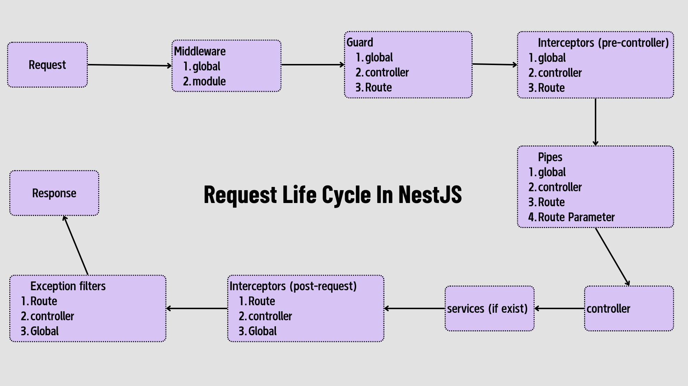

## NestJS & NextJS Boilerplate with Turborepo

This repository provides a scalable and efficient `monorepo` setup using Turborepo. It includes `NestJS` for backend
services and `NextJS` for frontend applications, with a suite of tools and libraries configured for seamless development
and deployment.

### **Features**

- `NestJS (v11)` backend
- `NextJS (v15)` frontend
- `SWC` for fast TypeScript and JavaScript transpilation
- `pnpm` for efficient dependency management
- `JWT` Access Token & Refresh Token Authentication for secure API access
- `PostgreSQL` database with TypeORM
- `Nodemailer` for email services
- `Linting` and `Formatting` pre-configured for code quality
- `Micro-Frontend` Support with Turborepo
- `Shadcn/UI` integration for styled components
- `Tailwindcss(v4)` integration in `@repo/shadcn`

### **Table of Contents**

- Installation
- Getting Started
- Project Structure
- Scripts
- Contributing
- License

### **Installation**

Clone the repository:

```shell
git clone https://github.com/devaungphyo/turbo-npn.git
```

Navigate to the project directory:

```shell
cd turbo-npn
```

Install dependencies using pnpm:

```shell
pnpm install
```

Getting Started
To start the development server, run:

```shell
pnpm dev
```

This will start both the NestJS backend and the Next.js frontend in development mode.

Project Structure
The repository is organized into the following structure:

```yaml
turborepo
├── .husky               # Git hooks
├── apps
│   ├── api              # NestJS application
│   └── web              # NextJS application
├── assets               # Assets folder for media assets
├── packages
│   ├── shadcn           # shadcn/UI component library
│   ├── ts-config        # Shared typescript configuration files
│   ├── eslint-config    # Shared eslint configuration files
│   ├── utils            # Shared utils functions
└── turbo.json           # Turborepo configuration
```

### Backend (NestJS)

The backend is powered by NestJS, with TypeORM configured to use PostgreSQL. JWT access token and refresh token
authentication is implemented for secure API access. Nodemailer is used to handle email services.



### Frontend (NextJS)

The frontend is built with NextJS v15, styled with shadcn/UI components. It is optimized for server-side rendering and
frontend authentication.
Micro-Frontend with Turborepo
Using Turborepo, the project supports a micro-frontend architecture, enabling shared libraries and configurations across
apps.

### To Add New UI Components to the UI Package

```shell
cd packages/shadcn
```

Then run the following command:

```shell
pnpm dlx shadcn@latest add
```

This will add the latest version of shadcn to the UI package.

`If you got an error in the UI package, change the import path`

```tsx
// form
import { cn } from '@repo/lib/utils';

// to
import { cn } from '@repo/shadcn/lib/utils';
```

### Scripts

- `pnpm add:api` - Adds a package specifically to the api workspace.
- `pnpm add:web` - Adds a package specifically to the web workspace.
- `pnpm build` - Builds both the backend and frontend for production using TurboRepo.
- `pnpm changeset` - Creates a new changeset for versioning updates.
- `pnpm clear:modules` - Clears all node_modules in the project using npkill.
- `pnpm commit` - Opens an interactive commit message interface using Commitizen (cz).
- `pnpm dev` - Starts both the backend and frontend in development mode using TurboRepo.
- `pnpm dev:api` - Starts the backend (api) in development mode.
- `pnpm dev:web` - Starts the frontend (web) in development mode.
- `pnpm format` - Formats the codebase according to the pre-configured Prettier rules.
- `pnpm format:check` - Checks the codebase formatting against Prettier rules without modifying files.
- `pnpm lint` - Lints all code in the repository using TurboRepo.
- `pnpm prepare` - Runs Husky to set up Git hooks.
- `pnpm prod` - Starts both the backend and frontend in production mode.
- `pnpm test` - Runs all tests defined in the repository using TurboRepo.

### Contributing

Contributions are welcome! Please fork this repository, make your changes, and submit a pull request.

### License

This project is licensed under the MIT License. See the [LICENSE](LICENSE) file for details.
